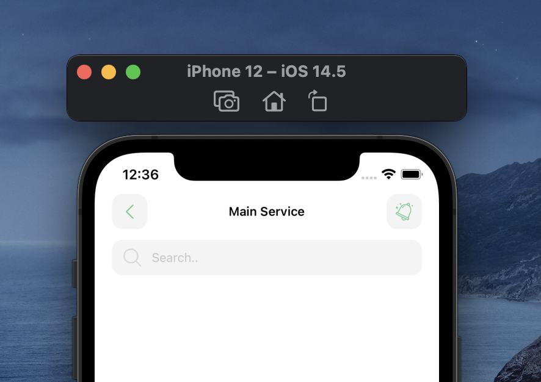
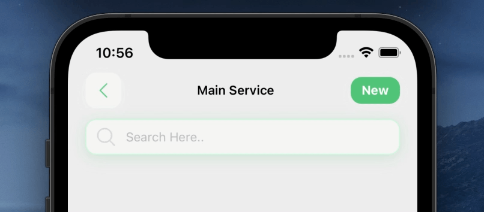

<p align="center">
  
  
</p>

## Library Usage

# Installation

Add the dependency:

```bash
npm i react-native-search-header-box
```

## Peer Dependencies

<h5><i>IMPORTANT! You need install them</i></h5>

```js
"react-native-androw": ">= 0.0.34"
```

# Usage

## Import

```jsx
import SearchHeaderBox from "react-native-search-header-box";
```

## Fundamental Usage

```jsx
<SearchHeaderBox />
```

## Advanced Usage

```jsx
<SearchHeaderBox
  headerText="Main Service"
  placeholder="Search Here.."
  rightButtonContainerStyle={{
    backgroundColor: "#50C479",
    borderRadius: 12,
    paddingLeft: 12,
    paddingRight: 12,
    paddingTop: 3,
    paddingBottom: 3,
    justifyContent: "center",
    alignItems: "center",
    width: 55,
    height: 30,
  }}
  rightButtonComponent={
    <Text style={{ color: "#fff", fontWeight: "700" }}>New</Text>
  }
  inputActiveBorderColor="#6AB786"
  inputBorderColor="#C9F6D9"
/>
```

## Example Project 😍

You can checkout the example project 🥰

Simply run

- `npm i`
- `react-native run-ios/android`

should work of the example project.

# Configuration - Props

## Customization (Optionals)

| Property                   |   Type    |  Default  | Description                                                                            |
| -------------------------- | :-------: | :-------: | -------------------------------------------------------------------------------------- |
| mainContainerStyle         | ViewStyle |  default  | set or override the style object for the main container                                |
| leftIconComponent          | Component |   Image   | set the content of the left button                                                     |
| headerText                 |  string   |    ''     | change the header title text                                                           |
| rightButtonComponent       | Component |   Image   | set the content of the right button                                                    |
| rightButtonBackgroundColor |  string   | '#F4F4F4' | change the right button background color                                               |
| headerTitleTextStyle       | TextStyle |  default  | set or override the style object for the header text                                   |
| headerTitleTextComponent   | Component |   Text    | set the header title                                                                   |
| searchIconComponent        | Component |   Image   | set the search icon component                                                          |
| textInputStyle             | TextStle  |  default  | set or override the style object for search text input                                 |
| bottomContainerStyle       | ViewStyle |  default  | set the override the bottom container                                                  |
| leftButtonContainerStyle   | ViewStyle |  default  | set or override the left button style                                                  |
| leftButtonBackgroundColor  |  string   | "#F4F4F4" | change the left button background color                                                |
| isVisibleLeftButton        |  boolean  |   true    | change the left button visibility                                                      |
| isVisibleRightButton       |  boolean  |   true    | change the right button visibility                                                     |
| isVisibleSearch            |  boolean  |   true    | change the search bar visibility                                                       |
| rightButtonContainerStyle  | ViewStyle |  default  | set or override the right button style                                                 |
| searchBarShadowColor       |  string   | '#50C479' | change the search bar shadow color                                                     |
| searchBarShadowStyle       | ViewStyle |  default  | set or override the search bar shadow style                                            |
| inputActiveBorderColor     |  string   | '#50C479' | change the active input border color                                                   |
| inputBorderColor           |  string   | '#F4F4F4' | change the input border color                                                          |
| leftButtonShadowStyle      | ViewStyle |  default  | set or override the left button shadow style                                           |
| leftButtonShadowColor      |  string   | '#F4F4F4' | change the left button shadow color                                                    |
| rightButtonShadowColor     | ViewStyle |  default  | set or override the right button shadow style                                          |
| rightButtonShadowStyle     |  string   | '#F4F4F4' | change the right button shadow color                                                   |
| onLeftButtonPress          | Function  | undefined | set your own logic for the left button functionality when the left button is pressed   |
| onRightButtonPress         | Function  | undefined | set your own logic for the right button functionality when the right button is pressed |

You can use all of the TextInput props.

## Future Plans

- [x] ~~LICENSE~~

## Author

Şevval Eygül sevvalleygull@gmail.com

## License

React Native Search Header Box is available under the MIT license. See the LICENSE file for more info.
